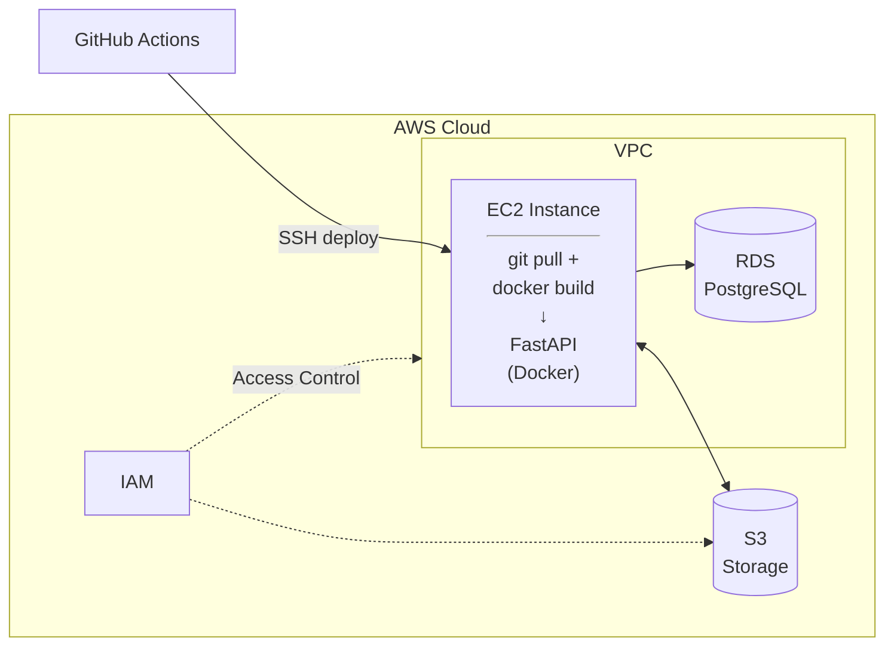

# Product Catalog API

A FastAPI application for managing a product catalog with image storage,
deployed to AWS Cloud using EC2, RDS, and S3.

## Architecture



## Prerequisites

- Python 3.13+
- Docker & Docker Compose
- AWS Account with CLI configured
- GitHub account

## Local Development

### 1. Clone and install dependencies

```bash
git clone <your-repo-url>
cd cloud-fastapi-deployment
uv sync
```

### 2. Set up environment variables

```bash
cp .env.example .env
# Edit .env with your local / AWS values
```

### 3. Run with Docker (recommended)

```bash
# Start app + local PostgreSQL
DOCKER_TARGET=development docker compose --profile local up
```

### 4. Run Alembic migrations

```bash
# With local Docker stack running:
docker compose exec app alembic upgrade head
```

### 5. Access the API

- Swagger UI: http://localhost:8000/docs
- Health check: http://localhost:8000/health

## AWS Resources

| Service | Resource           | Purpose               |
| ------- | ------------------ | --------------------- |
| IAM     | `fastapi-deployer` | Programmatic access   |
| RDS     | `fastapi-db`       | PostgreSQL 15 backend |
| S3      | `fastapi-app-files-*` | Product image storage |
| EC2     | t2.micro           | Application host      |

## Environment Variables

| Variable               | Description                | Default               |
| ---------------------- | -------------------------- | --------------------- |
| `DATABASE_URL`         | PostgreSQL connection URL  | Local Docker DB       |
| `AWS_ACCESS_KEY_ID`    | IAM access key             | —                     |
| `AWS_SECRET_ACCESS_KEY`| IAM secret key             | —                     |
| `AWS_REGION`           | AWS region                 | `ap-southeast-1`      |
| `S3_BUCKET_NAME`       | S3 bucket for file uploads | —                     |
| `ENVIRONMENT`          | `development` / `production` | `development`       |

## API Endpoints

| Method   | Endpoint                          | Description            |
| -------- | --------------------------------- | ---------------------- |
| `GET`    | `/health`                         | Health check           |
| `GET`    | `/categories`                     | List categories        |
| `POST`   | `/categories`                     | Create category        |
| `GET`    | `/categories/{id}`                | Get category           |
| `PUT`    | `/categories/{id}`                | Update category        |
| `DELETE` | `/categories/{id}`                | Delete category        |
| `GET`    | `/products`                       | List products          |
| `POST`   | `/products`                       | Create product         |
| `GET`    | `/products/{id}`                  | Get product            |
| `PUT`    | `/products/{id}`                  | Update product         |
| `DELETE` | `/products/{id}`                  | Delete product         |
| `POST`   | `/products/{id}/upload-image`     | Upload product image   |

## Deployment

Deployment is automated via GitHub Actions. On push to `main`:

1. SSH into EC2 instance
2. Pull latest code
3. Run Alembic migrations (with rollback on failure)
4. Rebuild Docker image on instance
5. Restart container

See `.github/workflows/deploy.yml` for the full pipeline.

## Project Structure

```
cloud-fastapi-deployment/
├── app/
│   ├── __init__.py
│   ├── main.py          # FastAPI application entry point
│   ├── config.py         # pydantic-settings configuration
│   ├── db.py             # SQLAlchemy engine & session
│   ├── models.py         # ORM models (Category, Product)
│   ├── schemas.py        # Pydantic request/response schemas
│   ├── s3_service.py     # S3 upload/delete service
│   └── routers/
│       ├── categories.py # Category CRUD endpoints
│       └── products.py   # Product CRUD + image upload
├── alembic/              # Database migrations
├── .github/workflows/    # CI/CD pipeline
├── Dockerfile            # Multi-stage build
├── docker-compose.yml    # Local dev + production
├── .env.example          # Environment variable template
└── README.md
```
